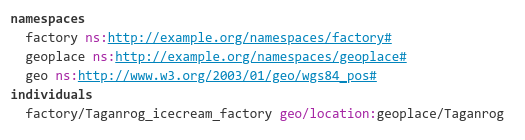

# Specification of Tabtree format

## About Tabtree

Tabtree — is a compact format to describe graphs. In particular it allows to more compactly write RDF triples. It uses some
syntactic sugar to make a work of editing ontologies in the code editor as easy as possible.

## Syntax

### Tabs

Tabs define a level in a hierarchy (the principle similar to Python)

**Tabtree source**

``` tabtree
Africa
  Kenya
    Elgeyo-Marakwet
      Iten
Europe
  Germany
    Saxony_Land
      Dresden
  Russia
    City_of_Moscow
      Belyaevo
      Zelenograd
    Rostov_region
      Taganrog
        Bogudonia
```

### Includes []

Big ontologies and knowledge graphs is good to divide into several
files, regarding the regions of internal cohesion. And then combine them
into one resulting Turtle file, ready for uploading to appropriate
semtech application.

Here is an example of pasting `factories.tree` contents into the
‘central’ file called `main.tree`

**Tabtree source**

``` tabtree
; main.tree
s1 p1:o1
s2 p2:o2

[factories.tree]
```

## Reification

For writing statements like:

*‘By March, 2020, the factory produced 2.5% fat strawberry-flavoured
yogurt’*

**Tabtree source**

``` tabtree
Milk_factory product:Yogurt_strawberry^fat:2.5^date:2020-03
```

**Turtle result**

``` turtle
Stmt_506_product_Yogurt_strawberry
  rdf:type rdf:Statement ;
  rdf:subject :Milk_factory ;
  rdf:predicate :product ;
  rdf:object :Yogurt_strawberry ;
  :fat "2.5"^^xsd:decimal ;
  :date "2020-03"^^xsd:date .
```

## Expanding

**+** sign propagates the predicate-object pair among all the children
of the node, where this form was written:

**Tabtree source**

``` tabtree
cities +a:UrbanPlace
  Beijing
  Shanghaj
  Shenzhen
    Futian_district
```

**Turtle result**

``` turtle
:Beijing rdf:type :UrbanPlace .
:Shanghaj rdf:type :UrbanPlace .
:Shenzhen rdf:type :UrbanPlace .
:Futian_district rdf:type :UrbanPlace .
```

**++** Double-plus sign includes predicate-object to the node of origin:

**Tabtree source**

``` tabtree
  Moscow ++a:UrbanPlace
    Zelenograd
      Noviy_Gorod
        Microdistrict_14
```

**Turtle result**

``` turtle
:Moscow rdf:type :UrbanPlace .
:Zelenograd rdf:type :UrbanPlace .
:Noviy_Gorod rdf:type :UrbanPlace .
:Microdistrict_14 rdf:type :UrbanPlace .
```

<b>\*</b> Asterisk sign overwrites predicate-object inherited from
above, while plain predicate-object without prefixes just adds up to the
inherited one:

**Tabtree source**

``` tabtree
  Moscow ++a:UrbanPlace
    Zelenograd
      Stariy_Gorod a:InformallyNamedArea
        Matushkino-Savelki *a:AdministrativeUnit
      Noviy_Gorod
        Microdistrict_14
```

**Turtle result**

``` turtle
:Moscow rdf:type :UrbanPlace .
:Zelenograd rdf:type :UrbanPlace .
:Stariy_Gorod rdf:type :UrbanPlace, :InformallyNamedArea .
:Matushkino-Savelki rdf:type :AdministrativeUnit .
:Noviy_Gorod rdf:type :UrbanPlace .
:Microdistrict_14 rdf:type :UrbanPlace .
```

## Tabtree file sections

  - namespaces
  - classes
  - properties
  - individuals

## Namespaces

**Tabtree source**
<!-- ```tabtree
namespaces
  factory ns:http://example.org/namespaces/factory#
  geoplace ns:http://example.org/namespaces/geoplace#
  geo ns:http://www.w3.org/2003/01/geo/wgs84_pos#
individuals
  factory/Taganrog_icecream_factory geo/location:geoplace/Taganrog
``` -->



**Turtle result**

    @prefix :factory <http://example.org/namespaces/factory#> .
    @prefix :geoplace <http://example.org/namespaces/geoplace#> .
    @prefix :geo <http://www.w3.org/2003/01/geo/wgs84_pos#> .

    factory:Taganrog_icecream_factory geo:location geoplace:Taganrog .

## Built-ins

Shorthand, frequently used predicates and classes, like
`rdfs:subClassOf` or `rdfs:range`

**Tabtree source**

```
  City subclass-of:UrbanPlace
```

**Turtle result**

```
  :City rdfs:subClassOf :UrbanPlace .
```

### Table of predicate built-ins

| Tabtree shorthand | Compiles to RDF Turtle |
| :---------------: | :--------------------: |
|         a         |        rdf:type        |
|    instance-of    |        rdf/type        |
|    subclass-of    |    rdfs/subClassOf     |
|  subproperty-of   |   rdfs/subPropertyOf   |
|        alt        |       owl/sameAs       |
|        eq         |       owl/sameAs       |
|     eq-class      |  owl/equivalentClass   |
|    eq-property    | owl/equivalentProperty |
|      domain       |      rdfs/domain       |
|       range       |       rdfs/range       |
|         d         |      rdfs/comment      |
|       name        |       rdfs/label       |
|   disjoint-with   |    owl/disjointWith    |

### Table of special classes

These classes are not compiled to something different, and needed to be
declared together with other resources, but in addition, transpiler uses
their names to define the type of object at compilation.

|  Tabtree class  |   Corresponds to    |
| :-------------: | :-----------------: |
|      Year       |    rdfs:Literal     |
|      Date       |      xsd:date       |
|     String      |     xsd:string      |
|     Double      |     xsd:double      |
|      Float      |      xsd:float      |
|     Decimal     |     xsd:decimal     |
| PositiveInteger | xsd:positiveInteger |
|     Integer     |     xsd:integer     |
|     Boolean     |     xsd:boolean     |
